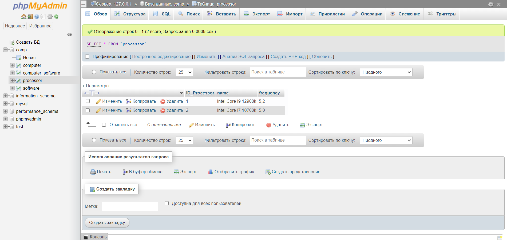
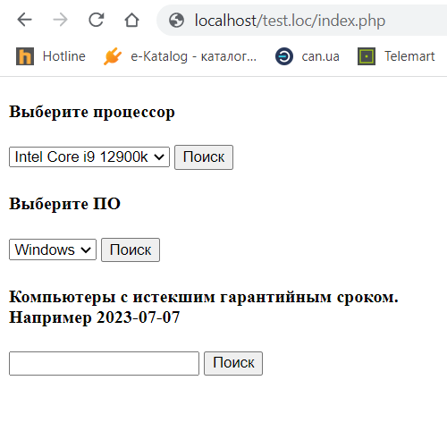

# lab1_itech
Лабораторная работа №1

Вариант 9. Создать и заполнить произвольными данными БД для хранения информации о компьютерах организации (Рисунок 5.9).

Для каждого компьютера задается сетевое имя, тип центрального процессора, тип материнской платы, объем ОЗУ и НЖМД, тип монитора, установленное программное обеспечение, фирма-продавец, дата покупки, срок гарантии.

Сформировать запросы и вывести результаты:

список компьютеров с заданным типом центрального процессора;
список компьютеров с установленным ПО (название ПО выбирается из перечня);
список компьютеров с истекшим гарантийным сроком.

Выполнил:
Шевченко В.С.,
ст. гр. КИУКИу-20-2

Задание

База данных

Таблица computer

Таблица computer_software

Таблица processor

Таблица software

php

select-1 result

select-2

select-2 result

select-3

select-3 result

